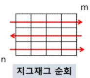

# 2차원 배열

- ## 2차원 배열

```python
list_2de = [[0, 1, 2 ,3], [4, 5, 6, 7]] # list 안의 list 형식
print(list_2de[1][2]) # 6
# 큰 list의 1번index->[4, 5, 6, 7] 의 2번 인덱스 - > 6 을 뜻한다.
```

 -> 어렵게 생각할 것 없이 list안 각 원소들이 list형으로 되어있다~ 라 생각하자.

- ## List Comprehension

```python
result = ['Hi' for _ in range(3)] 
print(result) # ['Hi', 'Hi', 'Hi']
```

  ->  List Comprehension은 대괄호 사이에 for문, 조건문 등을 사용하여 간결하게 List를 만들 수 있게 해준다.

``` python
# 3
# 1 2 3
# 4 5 6
# 7 8 9
n = int(input())
result = [list(map(int, input().split())) for _ in range(n)]
print(result) # [[1, 2, 3], [4, 5, 6], [7, 8, 9]]
```

  -> input 을 받는다면 위와 같이 출력된다.

- ## 배열 순회

```python
n, m = map(int, input().split()) # 3 4
list_a = [[0 for _ in range(m)] for _ in range(n)]

for i in range(n):
    for j in range(m):
        list_a[i][j] = 1 
print(list_a) # [[1, 1, 1, 1], [1, 1, 1, 1], [1, 1, 1, 1]]
# 이해하기 어렵다면 아래와 같은 행렬? 이 만들어져요
#[[1, 1, 1, 1]
# [1, 1, 1, 1]
# [1, 1, 1, 1]]

```

- ## 지그재그 순회

```python
for i in range(n):
    for j in range(m):
        list_a[i][j + (m-1-2*j) * (i%2)] 
```



- ## 델타 탐색

```python
# 3
# 1 2 3
# 4 5 6
# 7 8 9
n = int(input())
a = [[0]*(n+2)]+[[0]+list(map(int,input().split()))+[0] for _ in range(n)]+[[0]*(n+2)]

for i in range(len(a)):
    print(a[i])
# [0, 0, 0, 0, 0]
# [0, 1, 2, 3, 0]
# [0, 4, 5, 6, 0]
# [0, 7, 8, 9, 0]
# [0, 0, 0, 0, 0]
```

  -> 이런식으로 원하는 2차원 list를 감싸줄수 있어요. 우린 상하좌우 탐색을 할거니 index초과가 되면 	안되겠죠? 그래서 감싸줍시다. 이걸 먼저 알아야겠어요!

- ### 델타 탐색을 이용한 상하좌우 합.

```python
dx = [0, 0, -1, 1] # 왼쪽 오른쪽을 위해!
dy = [-1, 1, 0, 0] # 위 아래를 위해!
# 어떻게 쓰이는지 밑에서 볼까요?
n = int(input()) # 입력은 위 식과 똑같습니다.
a = [[0]*(n+2)]+[[0]+list(map(int,input().split()))+[0] for _ in range(n)]+[[0]*(n+2)]
sum_list =[] # 상하좌우 합을 더한 값을 내 list에 저~장 -_^

for i in range(1,n+1): # 이 부분은
    for j in range(1,n+1): # 저 위에서 배웠죠?
        sum_four = a[i][j] # 중앙값도 더해야하니 이걸 기본값으로 합시다!
        for k in range(4): # 4방향이니 4번만 돌돌돌
            sum_four += a[i+dy[k]][i+dx[k]] # 인덱스값이 계속 바뀌겠죠??
        sum_list.append(sum_four) # 다 합쳤으니 저~장 -_^
print(sum_list) # [7, 8, 9, 24, 25, 26, 21, 22, 23]
```

- ## 전치 행렬

```python
list_a = [[1, 2, 3],
          [4, 5, 6],
          [7, 8, 9]]

for i in range(3):
    for j in range(3):
        if i < j:
            list_a[i][j], list_a[j][i] = list_a[j][i], list_a[i][j]
            
for k in range(3):
    print(list_a[k])
# [1, 4, 7]
# [2, 5, 8]
# [3, 6, 9]
```

   -> 1, 5, 9를 이은 선을 기준으로 대칭해줬어요! 전치행렬 끝!

