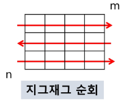

# 2차원 배열

- ## 2차원 배열

```python
list_2de = [[0, 1, 2 ,3], [4, 5, 6, 7]] # list 안의 list 형식
print(list_2de[1][2]) # 6
# 큰 list의 1번index->[4, 5, 6, 7] 의 2번 인덱스 - > 6 을 뜻한다.
```

 -> 어렵게 생각할 것 없이 list안 각 원소들이 list형으로 되어있다~ 라 생각하자.

- ## List Comprehension

```python
result = ['Hi' for _ in range(3)] 
print(result) # ['Hi', 'Hi', 'Hi']
```

  ->  List Comprehension은 대괄호 사이에 for문, 조건문 등을 사용하여 간결하게 List를 만들 수 있게 해준다.

``` python
# 3
# 1 2 3
# 4 5 6
# 7 8 9
n = int(input())
result = [list(map(int, input().split())) for _ in range(n)]
print(result) # [[1, 2, 3], [4, 5, 6], [7, 8, 9]]
```

  -> input 을 받는다면 위와 같이 출력된다.

- ## 배열 순회

```python
n, m = map(int, input().split()) # 3 4
list_a = [[0 for _ in range(m)] for _ in range(n)]

for i in range(n):
    for j in range(m):
        list_a[i][j] = 1 
print(list_a) # [[1, 1, 1, 1], [1, 1, 1, 1], [1, 1, 1, 1]]
# 이해하기 어렵다면 아래와 같은 행렬? 이 만들어져요
#[[1, 1, 1, 1]
# [1, 1, 1, 1]
# [1, 1, 1, 1]]

```

- 지그재그 순회

```python
for i in range(n):
    for j in range(m):
        list_a[i][j + (m-1-2*j) * (i%2)] 
```

