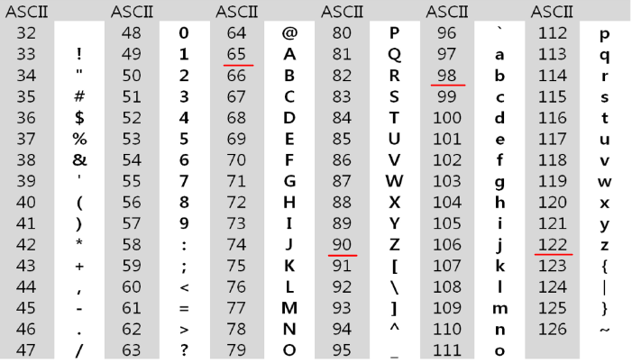

# 문자열

-   ## 아스키 코드



```python
print(ord(A)) # 이렇게 입력하면 출력값은 뭘까요? -> NameError: name 'A' is not defined
			 # 하하 오류납니다. A라는 문자열의 아스키 코드가 궁금한데 A라는 변수가 정의되지 않았다고 떠요

print(ord('A')) # 65
			   # 이렇게 해야 제대로된 아스키 코드 값을 알 수 있어요.
print(chr(65)) # A -> 65번 아스키코드 변환값을 가져오니 A가 나오겠죠
# ord()와 chr() 알아두도록 합시다!
```

-   ## input 차이

```python
s1 = list(input())
s2 = input()

print(s1, type(s1)) # ['a'] <class 'list'>
print(s2, type(s2)) # a <class 'str'>
print(s1[0], type(s1[0])) # a <class 'str'>
```

   -> 이건 따로 설명 안할게용

-   ## strlen() 함수를 만들어 보자!

   -> 특정 문자를 만나기 전까지 문자의 갯수를 세어주는 함수에옹

```python
def strlen(a): # 특정 문자를 만나기 전까지 글자수가 몇개인지 세어볼까요?
	cnt = 0	   # 카운트 하기위해 cnt를 초기화 할게요 0으로!
	while a[cnt] != '\0': # 그럼 '\0'을 만나기 전까지 돌돌돌
		cnt += 1		 # 카운트 해줄거랍니다 카운트와 동시에 인덱스번호도 올라가니 좋죠?
	return cnt			 # cnt를 반환하고
a = ['a', 'b', 'c', '\0']
print(strlen(a)) # 3 나오겠죠?
```

