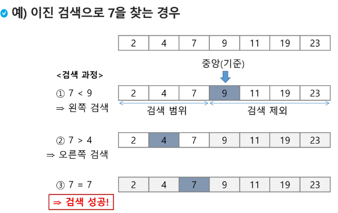

# 검색

-   기본


  -> 가장 기본적 찾기. 하나하나 따져보는 것.


  -> 만약 데이터가 무한대라면, 가장 최악의 경우. 위 두 예시는 정렬되지 않은 리스트 내에서 	찾는 것.

  -> 정렬을 한다면 최악은 방지. 해당 키값까지 순회하면 되기 때문.

```python
def sequentialSearch2(a, n, key):
    i = 0
    while i < n and a[i] < key:
        i += 1
    if i < n and a[i] == key:
        return i
    else:
        return -1
```

  -> 정렬된 리스트에서 찾기. 구현 예시.

-   ## 이진 탐색(Binary Search)

  -> 조건 :  **정렬되어있어야한다.**



  -> 처음과 끝의 중간값 기준으로 up, down 으로 찾아나감.

```python
# 만약 1과 500 사이에서 273을 찾고 싶다.
start, end = 1, 500 # 시작과 끝을 1과 500으로 할당
number = 273 # 찾기 원하는 값을 넣습니다. 여기엔 input()이 들어가죠.
while True: # 반복할겁니다. 찾을때 까지
    c = int((start+end)/2) # 핵심입니다. 시작과 끝을 더하고 2를 나눕니다.
    					# int 해준 이유는 정수를 반환하기 위해 해줍니다.
        				# int가 없다면 소수점으로 나오겠죠
    if number > c:		# 만약 중간값 보다 크다면
        start = c		# start 값을 c로 할당해 범위를 줄입니다(250, 500)
    elif number < c:	# 마찬가집니다 중간값 보다 작다면
        c = end			# end값을 c로 할당합니다. (1, 250)
    if c == number		# 위 과정을 반복하다가 c가 찾는 값이 된다면
    	print(c)		# c를 반환합니다.
    	break			# while문을 종료해줍니다.
    # start와 end 값을 조건에 따라 중간값으로 할당하며 계속 범위를 줄입니다.
```

  -> 위 코드는 제가 그냥 생각해서 짜본 코드입니다.

```python
def binarySearch(a, N, key): 
    start = 0
    end = N-1		# list 마지막 index는 list길이 -1 이겠죠?
    while start <=end:	# start가 end 보다 같거나 커지기 전까지 반복합니다.
        middle = (start + end) // 2  #중간값을 정해줍니다.
        if a[middle] == key:	#list a의 값이 key 같으면
            return true			# True를 반환하고 함수를 종료합니다.
        elif a[middle] > key:	# 만약 값이 크면?
            end = middle -1		# end값에 middle-1을 주입해 범위를 줄입니다.
        else:				# -1 +1을 해주는 이유는 인덱스를 생각해봅시다.
            start = middle + 1	#그 반대면 start값에 middle + 1 을 주입하구요
    return false			   #찾지 못하면 false를 반환해야겠죠.
a = [2, 4, 7, 9, 11, 19 ,23]
key = 11
N = len(a)
binarySearch(a, N, key) # True
```

-   ## 선택 정렬

```python
def selectionSort(a, N): #선택 정렬, 셀렉션 알고리즘이라 부릅니다.
    for i in range(N-1): # for문 돌려요 N-1의 이유는 차차 알아봅시다.
        midIdx = i		# i 값을 midIdx에 할당해요 이 이유도 알아봅시다.
        for j in range(i+1, N):	# for문을 i다음번 인덱스부터 N까지 돌립시다.
            if a[minIdx] > a[j]: # 만약 a[midIdx]가 a[j]보다 크다면?
                minIdx = j 		# midIdx에 j를 주고 for문을 돌려
                			# 더 작은 값을 확인합니다.
        a[i], a[midIdx] = a[midIdx], a[i] # 2번쨰의 반복문이 끝나면
        			# 가장 작은 값의 index와 첫번째 자리 index의 값을 바꿉니다.
    return a		# 2중 for문이 다 끝나면 정렬된 list를 return 합니다.
a = [2, 3, 1, 4, 6, 7]
N = len(a)
print(selectionSort(a, N)) # [1, 2, 3, 4, 6, 7]
```

-   ### 선택 정렬에 대한 간단한 애니메이션?


